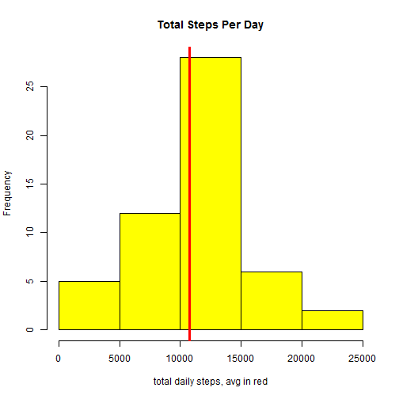
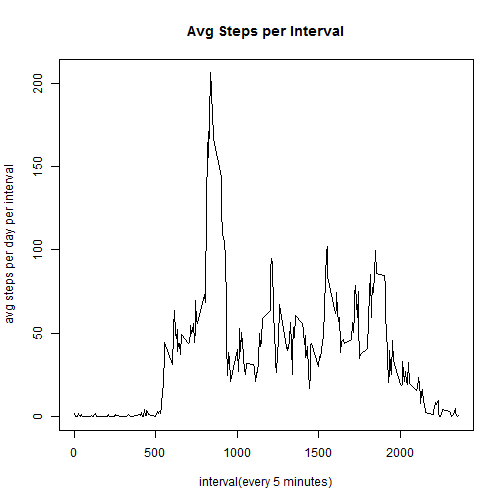
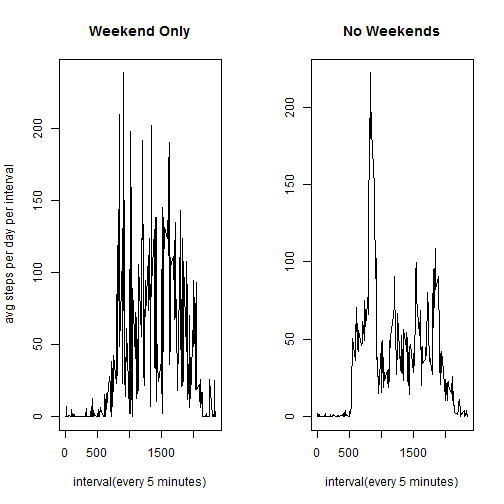

It is now possible to collect a large amount of data about personal movement using activity monitoring devices such as a Fitbit, Nike Fuelband, or Jawbone Up. These type of devices are part of the "quantified self" movement - a group of enthusiasts who take measurements about themselves regularly to improve their health, to find patterns in their behavior, or because they are tech geeks. But these data remain under-utilized both because the raw data are hard to obtain and there is a lack of statistical methods and software for processing and interpreting the data.

This assignment makes use of data from a personal activity monitoring device. This device collects data at 5 minute intervals through out the day. The data consists of two months of data from an anonymous individual collected during the months of October and November, 2012 and include the number of steps taken in 5 minute intervals each day.

The data is located at the following link:
[Source Data](<https://d396qusza40orc.cloudfront.net/repdata%2Fdata%2Factivity.zip>)
and was downloaded for use on November 14, 2015.

For convenience it is also included in the GIT repository.
[My Assignment Repo](<https://github.com/juliastudent/RepData_PeerAssessment1.git>)

_______________________________________

*About the data*

The variables included in this dataset are:

-steps: Number of steps taking in a 5-minute interval  
-date: The date of the measurement (YYYY-MM-DD)  
-interval: Identifier for the 5-minute interval in which measurement was taken  

The dataset is stored in a comma-separated-value (CSV) file and there are a total of 17,568 observations in this dataset.

_______________________________________

###Part 1: Load the data.

First we must load the data and for the initial analysis, remove all observations with missing values.  For more information about the origin of this data, see above section.


```r
act_all <- read.csv("activity.csv")
act <- act_all[which(!is.na(act_all$steps)),]
```

____________________________________

###Part 2: Steps Per Day

We will first calculate & plot the total number of steps taken per day. The overall average is in red.


```r
act_tot <- aggregate(steps~date,data=act,FUN="sum")
```
 

List of average steps - per day


```r
#calculate the mean steps per day
act_mean <- aggregate(steps~date,data=act, FUN="mean")
act_mean
```

```
##          date      steps
## 1  2012-10-02  0.4375000
## 2  2012-10-03 39.4166667
## 3  2012-10-04 42.0694444
## 4  2012-10-05 46.1597222
## 5  2012-10-06 53.5416667
## 6  2012-10-07 38.2465278
## 7  2012-10-09 44.4826389
## 8  2012-10-10 34.3750000
## 9  2012-10-11 35.7777778
## 10 2012-10-12 60.3541667
## 11 2012-10-13 43.1458333
## 12 2012-10-14 52.4236111
## 13 2012-10-15 35.2048611
## 14 2012-10-16 52.3750000
## 15 2012-10-17 46.7083333
## 16 2012-10-18 34.9166667
## 17 2012-10-19 41.0729167
## 18 2012-10-20 36.0937500
## 19 2012-10-21 30.6284722
## 20 2012-10-22 46.7361111
## 21 2012-10-23 30.9652778
## 22 2012-10-24 29.0104167
## 23 2012-10-25  8.6527778
## 24 2012-10-26 23.5347222
## 25 2012-10-27 35.1354167
## 26 2012-10-28 39.7847222
## 27 2012-10-29 17.4236111
## 28 2012-10-30 34.0937500
## 29 2012-10-31 53.5208333
## 30 2012-11-02 36.8055556
## 31 2012-11-03 36.7048611
## 32 2012-11-05 36.2465278
## 33 2012-11-06 28.9375000
## 34 2012-11-07 44.7326389
## 35 2012-11-08 11.1770833
## 36 2012-11-11 43.7777778
## 37 2012-11-12 37.3784722
## 38 2012-11-13 25.4722222
## 39 2012-11-15  0.1423611
## 40 2012-11-16 18.8923611
## 41 2012-11-17 49.7881944
## 42 2012-11-18 52.4652778
## 43 2012-11-19 30.6979167
## 44 2012-11-20 15.5277778
## 45 2012-11-21 44.3993056
## 46 2012-11-22 70.9270833
## 47 2012-11-23 73.5902778
## 48 2012-11-24 50.2708333
## 49 2012-11-25 41.0902778
## 50 2012-11-26 38.7569444
## 51 2012-11-27 47.3819444
## 52 2012-11-28 35.3576389
## 53 2012-11-29 24.4687500
```

List of median steps - per day


```r
#calculate the median steps per day
act_median <- aggregate(steps~date,data=act, FUN="median")
act_median
```

```
##          date steps
## 1  2012-10-02     0
## 2  2012-10-03     0
## 3  2012-10-04     0
## 4  2012-10-05     0
## 5  2012-10-06     0
## 6  2012-10-07     0
## 7  2012-10-09     0
## 8  2012-10-10     0
## 9  2012-10-11     0
## 10 2012-10-12     0
## 11 2012-10-13     0
## 12 2012-10-14     0
## 13 2012-10-15     0
## 14 2012-10-16     0
## 15 2012-10-17     0
## 16 2012-10-18     0
## 17 2012-10-19     0
## 18 2012-10-20     0
## 19 2012-10-21     0
## 20 2012-10-22     0
## 21 2012-10-23     0
## 22 2012-10-24     0
## 23 2012-10-25     0
## 24 2012-10-26     0
## 25 2012-10-27     0
## 26 2012-10-28     0
## 27 2012-10-29     0
## 28 2012-10-30     0
## 29 2012-10-31     0
## 30 2012-11-02     0
## 31 2012-11-03     0
## 32 2012-11-05     0
## 33 2012-11-06     0
## 34 2012-11-07     0
## 35 2012-11-08     0
## 36 2012-11-11     0
## 37 2012-11-12     0
## 38 2012-11-13     0
## 39 2012-11-15     0
## 40 2012-11-16     0
## 41 2012-11-17     0
## 42 2012-11-18     0
## 43 2012-11-19     0
## 44 2012-11-20     0
## 45 2012-11-21     0
## 46 2012-11-22     0
## 47 2012-11-23     0
## 48 2012-11-24     0
## 49 2012-11-25     0
## 50 2012-11-26     0
## 51 2012-11-27     0
## 52 2012-11-28     0
## 53 2012-11-29     0
```

______________________________________

###Part 3 Average Daily Activity Patterns

WE can plot the 5-minute interval (x-axis) and the average number of steps taken, averaged across all days (y-axis), to get a sense of what times of the day generated the most activity.


```r
act_int <- aggregate(steps~interval,data=act, FUN="mean", rm.na = TRUE)
```
 


Based on the above, we can see that the 5-minute interval, on average across ALL the days in the dataset (ignoring NAs), which contains the maximum number of steps occurs at minute 835, around 1 PM.


```r
#finr the interval with the greatest average
most_actv_int <- act_int[which(act_int$steps==max(act_int$steps)),]
most_actv_int$interval
```

```
## [1] 835
```

_______________________________________

###Part 4 - Adding Missing Values
 
Apologies but i ran out of time to do this one!  Ugh!!

_______________________________________

###Part 5 - Weekend Versus Weekday

We are interested in evaluating some differences between daily activity on the weekend versus weekdays.


```r
#subset the dataset based on weekdays
act_w_wkdy <- cbind(act, wkday=weekdays(as.POSIXct(act$date)))
act_wkd <- act_w_wkdy[which(act_w_wkdy$wkday==c("Saturday","Sunday")),]
act_wkdy <- act_w_wkdy[which(!(act_w_wkdy$wkday==c("Saturday","Sunday"))),]

#average the steps for weekends and weekdays
act_int_wkd <- aggregate(steps~interval,
      data=act_wkd, FUN="mean", rm.na = TRUE)
act_int_wkdy <- aggregate(steps~interval,
                         data=act_wkdy, FUN="mean", rm.na = TRUE)
```

Let's compare our findings for activity recorded at 5 minute intervals from weekends to weekdays.


 

It appears that during weekends, activity occurs more regularly throughout the day, and later into the evening.


